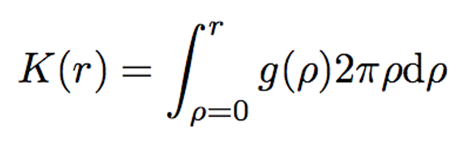
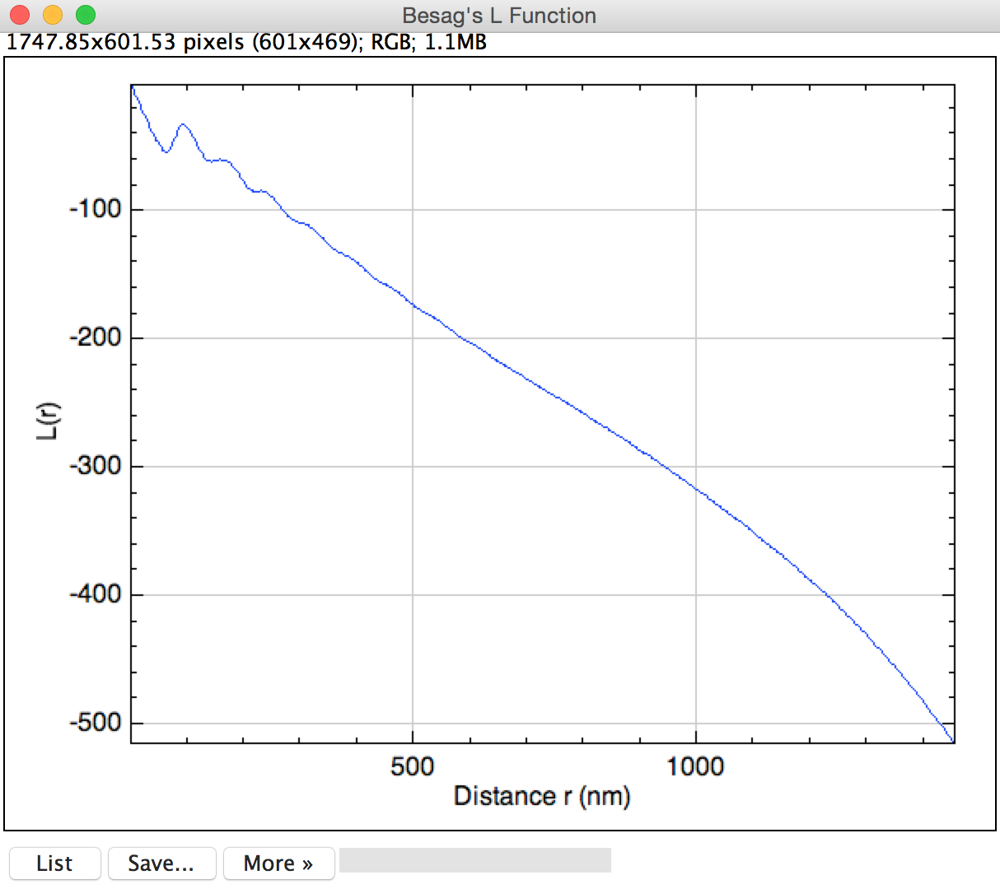

# Dot Analyzer for SEM micrographs

This document describes the workings of the ImageJ plugin **Dot Analyzer V3**, written by Philippe Girard ([email](philippe.girard@ijm.fr)).

The plugin was written to analyse SEM micrograph as shown here:

	
 
<i>Fig. 1:</i> A typical SEM micrograph.

## 1. Installation instructions
To install the plugin, just copy the file Dot_Analyzer.jar into the “plugins” directory, within the “ImageJ” directory.  
On PCs this directory is under “Program Files” and on a Mac it is under “Applications”.  Both require certain privileges to do this.  
Restart ImageJ.  The plugin is installed under the menu: 

> Plugins ▷ Dot Analyzer ▷ Dot Analyzer v3.1…

## 2. The “Parameters” main window.
When you start the plugin, you have to define different parameters for the analysis and to select the different diagrams/plots that you want to visualize (Fig. 2). 

	
 
<i>Fig. 2:</i> The “Parameters” main window
 

You must indicate:

1. Distance in pixels. 
2. Known Distance in nm that are used for conversion from pixel to nm. You should use the scale bar at the bottom left of the micrograph. For example, in the Heidelberg SEM data, the parameters are 200 nm = 171 pixels at 100.00 KX magnification. 
3. Set the minimum size (in pixels^2) to exclude objects that appear in the binary image that are clearly not objects of interest (Attention: this parameter is clearly connected to the thresholding method you have selected). This parameter is the same that appears in “Size ( ^2)” (where you have to define the minimum and the maximum size) of the “Analyze Particles” window. 
4. Select the Thresholding method: the list is the same that the one you can find directly in the Threshold window (Image ▷ Adjust ▷ Threshold…) as indicated below. The “MaxEntropy” method gives the best result on the Fig 1 but you have to consider trying different auto-threshold method. Here for example, the methods: “Default”, “IJ_IsoData” (=“Default”), “MaxEntropy”, “RenyiEntropy” and “Yen” are also good. If the threshold method you have selected do not give you the best result, you do not need to stop the plugin because it will ask you if you want to restart the analysis after the first step. 
5. Select “6-nearest neighbour diagram” if you want to visualize the 6 closest neighbours of each spots (see Fig. 3). In the analysis, the spots which are too closed to the borders are not taken into account because they do not have 6-closest neighbours as you can see on the Fig 3. Each spots is connected to its 6 neighbours with a line of different colours (red, orange, yellow, green, magenta, blue). 

	
 
<i>Fig. 3:</i> 6-nearest neighbor diagram of the Fig. 1.
 

6. Voronoi diagram (or tessellation) [**[1-4]**](#references). The Voronoi diagram is a simple mathematical construct that has proved useful in fields as diverse as environmental studies, cell biology, crystallography, transportation planning, and communications theory. Given a set of points (the center of mass of each gold-dot), the Voronoi diagram defines a series of cells surrounding each point. Each cell contains all points that are closer to its defining point than to any other point in the set. Subsequently, the “borders” of the cells are equidistant between the defining points of adjacent cells.By doing so, the number of borders give you the number of closest neighbors. The difference by the previous diagram (6 closest-neighbor diagram) is that you do not force each spot to have 6 neighbors. For patterns that contain non-uniform defect structures as disinclination, this diagram is more appropriated than the previous one. 
For more information about the Voronoi diagram, see the [Wikipedia webpage](http://en.wikipedia.org/wiki/Voronoi_diagram). 

	
 
<i>Fig. 4:</i> (Left) Points that make the Voronoi diagram. (Center) A Voronoi diagram constructed for those points. (Right) Delaunay in red and Voronoi in black constructed together on the same graphic.
 

7. Delaunay diagram (or triangulation) [**[3-4]**](#references). In graph theory, the Delaunay triangulation corresponds to the dual graph of the Voronoi tessellation. By dual, I mean to draw a line segment between two Voronoi vertices if their Voronoi polygons have a common edge, or in more mathematical terminology: there is a natural bijection between the two which reverses the face inclusions. This diagram gives the distance between the closest neighbors of each gold-dot. For more information about the Voronoi diagram, see the [Wikipedia webpage](http://en.wikipedia.org/wiki/Delaunay_triangulation). 

	
 
<i>Fig. 5:</i> (Left) Delaunay triangulation (in yellow) and Voronoi tessellation (in red) of points (in white) that define the dot positions of the Fig. 1. You can choose to represent only the Voronoi tessalation or the Delaunay triangulation.
 

8. “Besag’s <i>L</i> Function” (Fig. 6): The Besag's <i>L</i> Function is based on the Ripley's <i>K</i> Function. Details of various theoretical aspects of K are in books [**[5-7]**](#references). Ripley’s K function is a popular tool to analyze mapped spatial point pattern. It is defined without edge correction as:

	

If points are distributed independently from each other, g(ρ)=1 for all values of ρ, so <i>K(r) = πr2</i>. This value is used as a benchmark: 

* <i>K(r) > πr2</i> indicates that the average value of g(ρ) is greater than 1. The probability to find a neighbor at the distance ρ is then greater than the probability to find a point in the same area anywhere in the domain: points are aggregated.  

* Inversely, <i>K(r) < πr2</i> indicates that the average neighbor density is smaller than the average point density on the studied domain. Points are dispersed. <i>K(r)</i> is estimated by the ratio of the average number of neighbors on the density, estimated itself by the total number of points divided by the domain area λ which is the density (number per unit area = N/area of the picture) of event. Given that only the points in a bounded window of observation can be studied, edge correction is necessary to obtain precise estimates. The weighted edge-corrected function <i>K(r)</i> is defined as: 

	

where <i>I(rij ≤ r)</i> is an indication function with values either 0 if the condition does not hold or 1 if the condition holds and where the weight <i>wij(r)</i> is the proportion of the circumference of a circle centered at the gold-dot <i>i</i> passing through the gold-dot <i>j</i> and that is inside the region of interest (ROI), which is defined as  

	

where <i>rib</i> is the distance from the gold-dot <i>i</i> to the nearest boundary, <i>rib1</i> and <i>rib2</i> are the distances from gold-dot <i>i</i> to the nearest two boundaries. The first case when the circle is within the ROI, the second case is when the circle intersects with only one border and the last case is when the circle intersects two borders in a corner. Note that <i>wij(r)</i> could be unbounded as <i>r</i> increases in practice. Following the recommendation by Ripley,<i>wij(r)</i> could be restricted to be less than or equal to 4 for the gold-dot <i>i</i> having distance to <i>j</i> greater than the distance from the gold-dot <i>i</i> to the nearest boundary. 
The Besag's <i>L</i> function is just a normalization of the Ripley's function:  

	

because for a homogenous Poisson process, the Ripley function is <i>K(r) = πr2</i>. So the Besag's function is a measure of the deviation from a Poisson distribution and it is very useful because <i>L(r)</i> has the advantage of linearizing <i>K(r)</i> and stabilizing its variance and has an expected value of zero for Poisson distribution. So <i>L(r)</i> can also be considered as a measure of the clusterization. 

	
 
<i>Fig. 6:</i> Besag’s L Function of Fig. 1.
 

9. “Pair correlation function” (Fig. 7) is measured with the Epanechnikov kernel [**[8]**](#references) and an Ohser-Stoyan edge corrector factor [**[9]**](#references). The estimation of the pair correlation function g(r) can be obtained by determining all pairs of gold-dots having inter-gold-dot distance in some small interval and counting their numbers. Since g(r) is a density function, a more elegant method can be employed. Following the recommendation of Penttinen et al. [**[6]**](#references), a kernel estimator is used for g(r). The chosen kernel function is the Epanechnikov kernel: 

	
 
<i>Fig. 7:</i> Pair Correlation Function g(r) of Fig. 1. In red g(r)=1 corresponds to a homogeneous Poisson process.
 

10. “Bond-orientational correlation function” (Fig. 8): The (global) bond-orientationel order parameter 6 was introduced by D. R. Nelson and B. I. Halperin to characterize the structural order in 2D systems [**[10-11]**](#references). It is given:

	
 
<i>Fig. 8:</i> Bond-orientational Correlation Function g6(r) of Fig. 1. In red is the fit of g6(r) with an exponential decay.

11. “Save Spacing and Order in a table”: this indicates that you want to save the spacing and the order in a text file. If you select this option, a “Save Spacing & Order” window will appear at the end of the analysis (see below). 

When you have finished, press OK. 

## 3. Analysis

### At the beginning of the process, 

First, the image is converted to a binary image to reveal the spots (by the threshold method you have selected) and an overlay of the image with the subtracted background (in grey) and the threshold image (in red) is shown in order to select a rectangular ROI (in yellow) with the “Rectangle Tool” of the Toolbar to remove the text of the micrograph or the area where the plugin is not able to detect simple spots but huge multiple spot, or where there is some disinclinations. For example in the figure below, a rectangular area (in yellow) that removes the bottom part is selected (Fig 9, left). After selection, you can click OK on the frame that appears at right of the overlay. If you want to select the full image, just press ok without selection (Fig. 9, right).

	
 
<i>Fig. 9:</i> The Overlay: Subtracted-background image (in grey) / threshold image (in red).
 

Then, the function “ParticleAnalyzer” that you can found directly under “Analyze/Analyze Particles…” is applied to detect the position of the different spots (the parameter “Min size” you have selected at the beginning is use here to remove all the spot below this size in pixel^2). This process permits to measure the centre of mass of each spot. 

### At the end of the process, 
The “Results” main window gives you the results of the 6 closest-neighbor method (Fig 10). 

	
 
<i>Fig. 10:</i> The “Results” main window: Analysis of the selected region (of Fig. 9).
 

You can also restart the process if you did a mistake by clicking “Yes, please”, or press “No way!” if you want to continue (Fig. 11). 

	
 
<i>Fig. 11:</i> Restart or not Window.
 

## 4. Save Result: Spacing and Order

You have to fill the different characteristics of your system in the “Save Spacing & Order” main window (Fig. 12) and all these parameters are saved in a new or existed file (see Fig 13).

1. First row: Polymer
	* First copolymer (in the list: PS, P2VP, PDMS, PMMA) with the number of monomer (Fig. 12a at left)
	* Second copolymer (Fig. 12a at right)
2. Second row:
	* Loading rate of gold (between 0 and 1), 
	* Polymer concentration (in mg/ml) 
3. Third row:
	* Select if you have use the dipping method (False) or spinning method (True). If you select spinning method the “dipping speed” is disabled and in grey because you do not have to specify it (Fig. 12b).  
	* Dipping speed (in Volts).

4.	Fourth row:
	* Date of the file when it was created (automatically filled with the information of the image), 
	* Add in an existed file (Yes = True, No = False). The created file is automatically saved in the folder of the analysed image.
	

	
 
<i>Fig. 12:</i> The “Save Spacing & Order” main window.
 

The File created contains the following parameters of the analysis:

1. Filename, 
2. Polymer, (example: PS[52400]-P2VP[28100])
3. Loading, 
4. Concentration (mg/ml),
5. Speed (V),
6. Date (yy/mm/dd), 
7. Region of Interest: X, Y, Width, Height (a column for each parameter) 
8. Number of dots (with the 6-nearest neighbor model),
9. Spacing in nm (with the 6-nearest neighbor model)
10. Stdev (Standard deviation) in nm  (with the 6-nearest neighbor model)
11. Sterror (Standard error) in nm  (with the 6-nearest neighbor model)
12. Order Parameter
13. Number of dots (with the Voronoi/Delaunay model)
14. Spacing in nm (with the Voronoi/Delaunay model)
15. Stdev in nm (with the Voronoi/Delaunay model)
16. Sterror in nm (with the Voronoi/Delaunay model)
17. Order Parameter (with the Voronoi/Delaunay model)

To open the file you can use a Text Edit Application or Excel (with File ▷ Import) as indicated in Fig. 13:

	
 
<i>Fig. 13:</i> In Excel use File/Import and select “Text file” (panel a). Text Import Wizard in 3 steps from Excel(panel b). Panel c is the result of the imported file corresponding to the parameters of the analysed image (Fig. 9).
 

## References

 [1] G. F. Voronoï. Deuxième mémoire: recherches sur les paralléloèdres primitifs. J. Reine Angew. Math., 136:67–181, 1909. 
 
 [2] G. M. Voronoï. Nouvelles applications des paramètres continus à la théorie des formes quadratiques. deuxième Mémoire: Recherches sur les parallélloèdres primitifs. J. Reine Angew. Math., 134:198–287, 1908. 
 
 [3] Okabe, A et al., K. Spatial Tessellations: Concepts and Applications of Voronoi Diagrams, 2nd ed. New York: Wiley, 2000.
 
 [4] F. Aurenhammer. Voronoi diagrams - a survey of a fundamental geometric data structure. ACM Transactions on Mathematical Software, 23:469-483, 1996.
 
 [5] Ripley B. D. Spatial Statistics, Wiley, New York, 1981.
 
 [6] Diggle P.J. Statistical Analysis of Spatial Point Patterns, Academic Press, New York, 1983.
 
 [7] Cressie N.A.C. Statistics for Spatial Data, Wiley, New York, 1991.
 
 [8] Penttinent et al. Marked point processes in forest statistics. For. Sci. 38, 806-824, 1992.
 
 [9] Stoyan et al. Stochastic Geometry and its applications, Wiley, New York, 1987.

[10] B. I. Halperin and D. R. Nelson, Phys. Rev. Lett. 41, 121, 1978. 

[11] D. R. Nelson and B. I. Halperin, Phys. Rev. B 19, 2456, 1979.

[12] C.A. Murray, in Bond-orientational order in condensed matter systems, edited by K. Strandburg, Springer-Verlag, New York, pp. 137–215, 1992.

[13] D.R. Nelson, Defects and geometry in condensed matter physics, Cambridge University Press, Cambridge, 2002.

[14] D.R. Nelson, M. Rubinstein, Phil. Mag. A. 46, 105, 1982.
